# Work Shift Feature - Product Requirements Document

## 1. Product Overview

Fitur Work Shift adalah sistem manajemen shift kerja yang memungkinkan admin untuk mengelola berbagai jenis shift kerja dan menugaskan multiple shift kepada karyawan. Fitur ini dirancang untuk mendukung operasional perusahaan yang memiliki jadwal kerja fleksibel dengan berbagai shift kerja.

Fitur ini mengatasi kebutuhan perusahaan untuk mengelola karyawan yang bekerja dalam multiple shift, memberikan fleksibilitas dalam penjadwalan, dan memastikan tracking yang akurat untuk sistem absensi. Target utama adalah meningkatkan efisiensi manajemen SDM dan memberikan visibilitas yang jelas terhadap alokasi shift karyawan.

## 2. Core Features

### 2.1 User Roles

| Role | Registration Method | Core Permissions |
|------|---------------------|------------------|
| Admin | System assignment | Full CRUD access untuk work shifts dan user assignments |
| Manager | Admin invitation | Read access untuk work shifts, limited assignment untuk tim |
| Employee | Admin registration | Read-only access untuk shift assignments mereka |

### 2.2 Feature Module

Fitur Work Shift terdiri dari halaman-halaman utama berikut:
1. **Work Shift Management**: master data management, CRUD operations, shift configuration.
2. **User Assignment**: multi-select assignment, bulk operations, assignment history.
3. **Shift Dashboard**: overview statistics, active shifts, assignment summary.

### 2.3 Page Details

| Page Name | Module Name | Feature description |
|-----------|-------------|---------------------|
| Work Shift Management | Master Data CRUD | Create, read, update, delete work shifts dengan validasi lengkap. Configure shift properties seperti waktu, toleransi, dan status aktif |
| Work Shift Management | Shift Configuration | Set start_time, end_time, is_cross_day flag, grace_period_minutes, dan description untuk setiap shift |
| User Assignment | Multi-Select Interface | Select multiple work shifts untuk setiap user dengan dropdown yang responsif dan searchable |
| User Assignment | Bulk Operations | Assign atau unassign shifts secara batch untuk multiple users sekaligus |
| User Assignment | Assignment Validation | Validate shift assignments, check conflicts, dan ensure data integrity |
| Shift Dashboard | Statistics Overview | Display total shifts, active assignments, dan usage analytics |
| Shift Dashboard | Assignment Summary | Show current shift assignments per user dan shift utilization |

## 3. Core Process

**Admin Flow:**
1. Admin login ke sistem
2. Navigate ke Work Shift Management untuk create/edit master shifts
3. Configure shift properties (waktu, toleransi, cross-day settings)
4. Navigate ke User Management untuk assign shifts
5. Select user dan choose multiple work shifts
6. Save assignments dengan validasi otomatis
7. Monitor assignments melalui Shift Dashboard

**Manager Flow:**
1. Manager login dengan limited permissions
2. View existing work shifts (read-only)
3. Assign shifts untuk team members (jika diberi akses)
4. Monitor team shift assignments

**Employee Flow:**
1. Employee login ke sistem
2. View assigned work shifts di profile
3. Check shift schedule dan requirements

```mermaid
graph TD
    A[Login] --> B{Role Check}
    B -->|Admin| C[Work Shift Management]
    B -->|Manager| D[Limited Assignment]
    B -->|Employee| E[View Assignments]
    
    C --> F[Create/Edit Shifts]
    C --> G[User Assignment]
    F --> H[Configure Properties]
    G --> I[Multi-Select Interface]
    I --> J[Save & Validate]
    
    D --> K[Team Assignment]
    K --> I
    
    E --> L[Profile View]
    
    J --> M[Shift Dashboard]
    L --> M
```

## 4. User Interface Design

### 4.1 Design Style

- **Primary Colors**: #3B82F6 (blue-500) untuk primary actions, #10B981 (emerald-500) untuk success states
- **Secondary Colors**: #6B7280 (gray-500) untuk secondary elements, #EF4444 (red-500) untuk danger states
- **Button Style**: Rounded corners (rounded-md), subtle shadows, hover effects dengan color transitions
- **Font**: Inter atau system fonts, 14px untuk body text, 16px untuk labels, 18px untuk headings
- **Layout Style**: Card-based design dengan clean spacing, top navigation dengan breadcrumbs
- **Icons**: Heroicons untuk consistency, menggunakan outline style untuk secondary actions dan solid untuk primary

### 4.2 Page Design Overview

| Page Name | Module Name | UI Elements |
|-----------|-------------|-------------|
| Work Shift Management | Master Data Form | Card layout dengan form fields, primary blue buttons, validation error states dalam red-500, success notifications dalam emerald-500 |
| Work Shift Management | Data Table | Striped table dengan hover effects, action buttons dengan icons, search dan filter controls |
| User Assignment | Multi-Select Dropdown | Searchable dropdown dengan checkboxes, selected items dengan badges, clear visual feedback |
| User Assignment | Assignment Interface | Two-column layout, user list di kiri, shift selection di kanan, drag-drop support |
| Shift Dashboard | Statistics Cards | Grid layout dengan metric cards, charts menggunakan Chart.js, responsive design |
| Shift Dashboard | Assignment Summary | Table dengan color-coded status, expandable rows untuk details |

### 4.3 Responsiveness

Aplikasi menggunakan desktop-first approach dengan mobile-adaptive design. Touch interaction dioptimalkan untuk tablet dan mobile devices. Breakpoints mengikuti Tailwind CSS standards (sm: 640px, md: 768px, lg: 1024px, xl: 1280px). Multi-select components menggunakan native mobile interfaces pada perangkat touch.