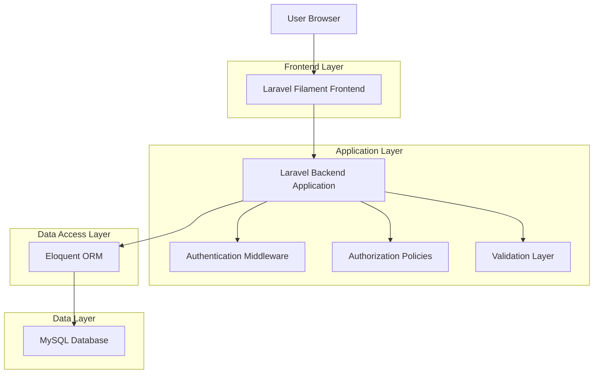
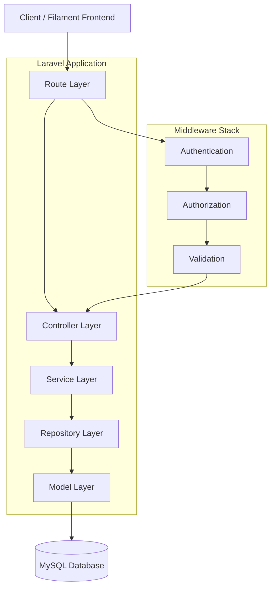
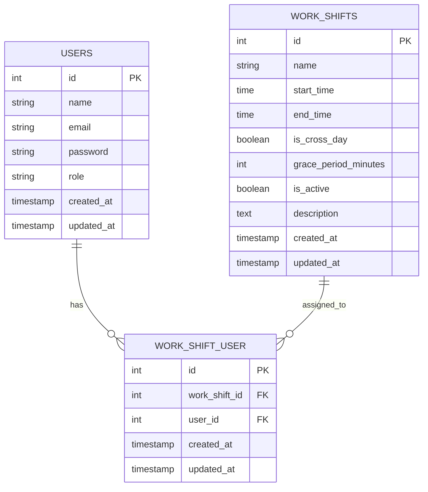

# Work Shift Feature - Technical Architecture Document

## 1. Architecture Design



## 2. Technology Description

- Frontend: Laravel Filament@3 + Tailwind CSS@3 + Alpine.js
- Backend: Laravel@10 + PHP@8.1
- Database: MySQL@8.0
- ORM: Eloquent ORM
- Authentication: Laravel Sanctum
- Validation: Laravel Form Requests

## 3. Route Definitions

| Route | Purpose |
|-------|---------|
| /admin/work-shifts | Work shift management dashboard |
| /admin/work-shifts/create | Create new work shift form |
| /admin/work-shifts/{id}/edit | Edit existing work shift |
| /admin/users/{id}/edit | User management with shift assignment |
| /admin/work-shifts/bulk-assign | Bulk shift assignment interface |
| /api/work-shifts | API endpoint untuk work shift data |

## 4. API Definitions

### 4.1 Core API

Work Shift Management
```
POST /api/work-shifts
```

Request:
| Param Name | Param Type | isRequired | Description |
|------------|------------|------------|-------------|
| name | string | true | Nama shift kerja |
| start_time | time | true | Waktu mulai shift (HH:MM:SS) |
| end_time | time | true | Waktu selesai shift (HH:MM:SS) |
| is_cross_day | boolean | false | Flag untuk shift lintas hari |
| grace_period_minutes | integer | false | Masa toleransi dalam menit |
| is_active | boolean | false | Status aktif shift |
| description | string | false | Deskripsi shift |

Response:
| Param Name | Param Type | Description |
|------------|------------|-------------|
| id | integer | ID shift yang dibuat |
| name | string | Nama shift |
| start_time | time | Waktu mulai |
| end_time | time | Waktu selesai |
| is_cross_day | boolean | Flag lintas hari |
| grace_period_minutes | integer | Masa toleransi |
| is_active | boolean | Status aktif |
| description | string | Deskripsi |
| created_at | timestamp | Waktu dibuat |
| updated_at | timestamp | Waktu diupdate |

Example Request:
```json
{
  "name": "Shift Pagi",
  "start_time": "08:00:00",
  "end_time": "16:00:00",
  "is_cross_day": false,
  "grace_period_minutes": 15,
  "is_active": true,
  "description": "Shift kerja pagi hari"
}
```

User Shift Assignment
```
POST /api/users/{user_id}/work-shifts
```

Request:
| Param Name | Param Type | isRequired | Description |
|------------|------------|------------|-------------|
| work_shift_ids | array | true | Array ID work shifts |

Response:
| Param Name | Param Type | Description |
|------------|------------|-------------|
| user_id | integer | ID user |
| assigned_shifts | array | Array work shifts yang di-assign |
| message | string | Pesan konfirmasi |

Example Request:
```json
{
  "work_shift_ids": [1, 2, 3]
}
```

## 5. Server Architecture Diagram



## 6. Data Model

### 6.1 Data Model Definition



### 6.2 Data Definition Language

Work Shifts Table (work_shifts)
```sql
-- Create work_shifts table
CREATE TABLE work_shifts (
    id BIGINT UNSIGNED AUTO_INCREMENT PRIMARY KEY,
    name VARCHAR(255) NOT NULL,
    start_time TIME NOT NULL,
    end_time TIME NOT NULL,
    is_cross_day BOOLEAN DEFAULT FALSE,
    grace_period_minutes INT DEFAULT 0,
    is_active BOOLEAN DEFAULT TRUE,
    description TEXT NULL,
    created_at TIMESTAMP NULL DEFAULT CURRENT_TIMESTAMP,
    updated_at TIMESTAMP NULL DEFAULT CURRENT_TIMESTAMP ON UPDATE CURRENT_TIMESTAMP
);

-- Create indexes
CREATE INDEX idx_work_shifts_name ON work_shifts(name);
CREATE INDEX idx_work_shifts_is_active ON work_shifts(is_active);
CREATE INDEX idx_work_shifts_start_time ON work_shifts(start_time);
```

Work Shift User Pivot Table (work_shift_user)
```sql
-- Create work_shift_user pivot table
CREATE TABLE work_shift_user (
    id BIGINT UNSIGNED AUTO_INCREMENT PRIMARY KEY,
    work_shift_id BIGINT UNSIGNED NOT NULL,
    user_id BIGINT UNSIGNED NOT NULL,
    created_at TIMESTAMP NULL DEFAULT CURRENT_TIMESTAMP,
    updated_at TIMESTAMP NULL DEFAULT CURRENT_TIMESTAMP ON UPDATE CURRENT_TIMESTAMP,
    
    FOREIGN KEY (work_shift_id) REFERENCES work_shifts(id) ON DELETE CASCADE,
    FOREIGN KEY (user_id) REFERENCES users(id) ON DELETE CASCADE,
    UNIQUE KEY unique_work_shift_user (work_shift_id, user_id)
);

-- Create indexes
CREATE INDEX idx_work_shift_user_work_shift_id ON work_shift_user(work_shift_id);
CREATE INDEX idx_work_shift_user_user_id ON work_shift_user(user_id);
CREATE INDEX idx_work_shift_user_created_at ON work_shift_user(created_at DESC);
```

Initial Data
```sql
-- Insert sample work shifts
INSERT INTO work_shifts (name, start_time, end_time, is_cross_day, grace_period_minutes, is_active, description) VALUES
('Shift Pagi', '08:00:00', '16:00:00', FALSE, 15, TRUE, 'Shift kerja pagi hari dari jam 8 sampai 4 sore'),
('Shift Siang', '16:00:00', '00:00:00', TRUE, 15, TRUE, 'Shift kerja siang hingga malam hari'),
('Shift Malam', '00:00:00', '08:00:00', TRUE, 10, TRUE, 'Shift kerja malam hingga pagi hari'),
('Shift Fleksibel', '09:00:00', '17:00:00', FALSE, 30, TRUE, 'Shift kerja dengan waktu fleksibel');

-- Grant permissions for authenticated users
GRANT SELECT, INSERT, UPDATE, DELETE ON work_shifts TO authenticated;
GRANT SELECT, INSERT, UPDATE, DELETE ON work_shift_user TO authenticated;
```